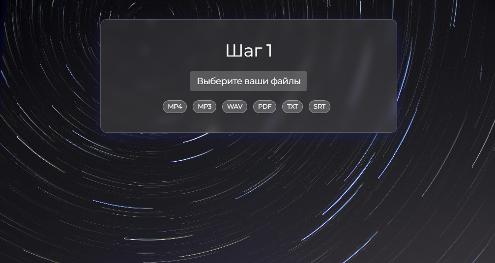
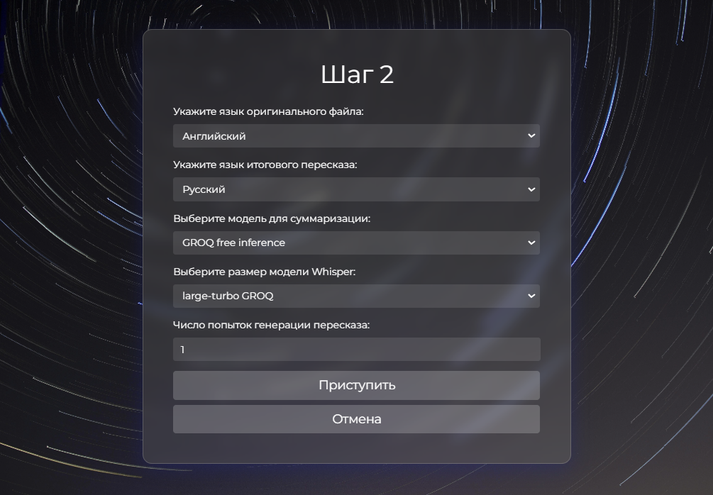
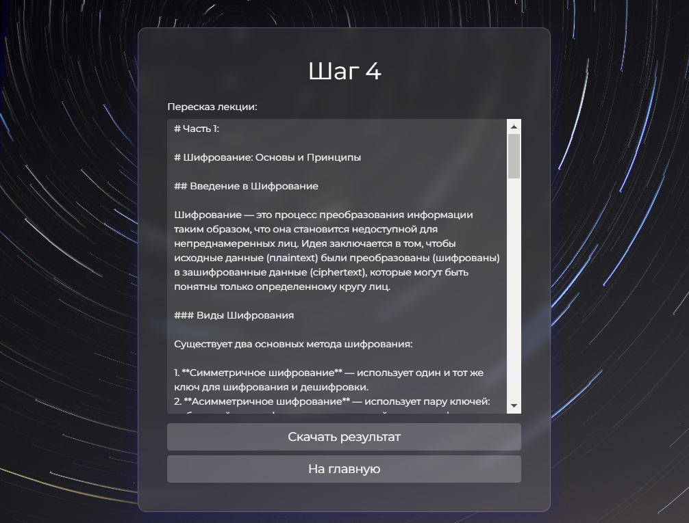
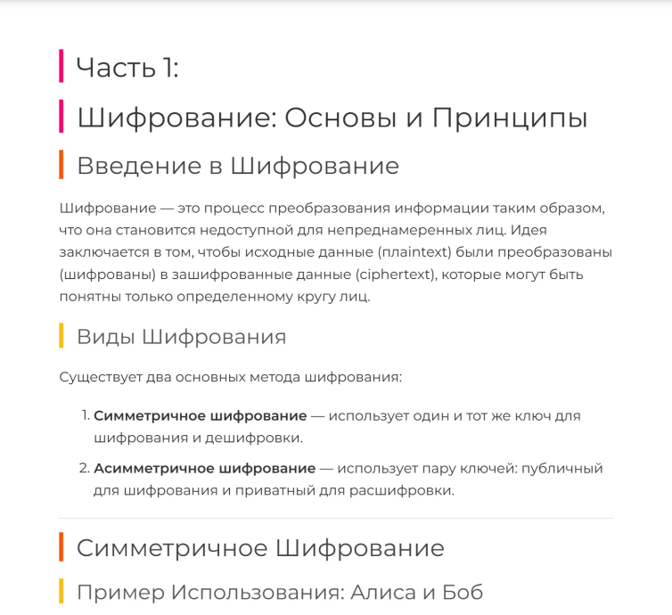

# Lecture Summarizer

## Description

This project uses Whisper and Large Language Models (LLMs) to summarize lectures from audio/video files. It provides an intuitive web interface for uploading files, selecting summarization options, and viewing the generated markdown summaries.

<table>
  <tr>
    <td></td>
    <td></td>
  </tr>
  <tr>
    <td></td>
    <td></td>
  </tr>
</table>

## Features

- **Summarization of Multiple File Formats:** Supports summarization of `mp4`, `mp3`, `wav`, `pdf`, `txt`, and `srt` files without limits on file count.
- **Automatic Audio Transcription:** Extracts text from audio in `mp4`, `mp3`, and `wav` files.
- **Markdown Output:** Presents summaries in markdown format, ideal for tools like Obsidian.
- **Download Rendered Results:** Allows downloading the generated markdown as a PDF file.
- **User-Friendly Web Interface:** Provides a clean interface with adjustable summarization settings.
- **Language Selection:** Choose the language for summarization, enhancing accuracy.
- **Enhanced Summarization:** Perform multiple summarization attempts with automated selection of the best result for improved summaries.
- **API Integrations for Summarization:**
  - **OpenAI API**
  - **Gemini API**
  - **Ollama for Local LLMs**
- **Free Inference Support:**
  - **GROQ for transcription and summarization**
  - **Hugging Face for summarization**

## How to Run

1. **Clone the repository:**

   ```bash
   git clone https://github.com/unrlight/Lecture-Summarizer-Py.git
   cd Lecture-Summarizer-Py
   ```

2. **Install the requirements:**

   ```bash
   pip install -r requirements.txt
   ```

3. **Set up API keys:**

   ### GROQ Free Inference
   Add your GROQ API key as an environment variable or in the `.env` file:
   - **Environment Variable:**
     ```bash
     export groq_api_keys=YOUR_API_KEY # For Linux/macOS
     set groq_api_keys=YOUR_API_KEY # For Windows
     ```
   - **.env file:**
     ```plaintext
     groq_api_keys=YOUR_API_KEY
     ```

   ### Hugging Face Free Inference
   Add your Hugging Face API key:
   - **Environment Variable:**
     ```bash
     export hf_api_keys=YOUR_API_KEY # For Linux/macOS
     set hf_api_keys=YOUR_API_KEY # For Windows
     ```
   - **.env file:**
     ```plaintext
     hf_api_keys=YOUR_API_KEY
     ```

   ### OpenAI API
   Add your OpenAI API key:
   - **Environment Variable:**
     ```bash
     export open_ai_api_keys=YOUR_API_KEY # For Linux/macOS
     set open_ai_api_keys=YOUR_API_KEY # For Windows
     ```
   - **.env file:**
     ```plaintext
     open_ai_api_keys=YOUR_API_KEY
     ```

   ### Gemini API
   Add your Gemini API key:
   - **Environment Variable:**
     ```bash
     export gemini_api_keys=YOUR_API_KEY # For Linux/macOS
     set gemini_api_keys=YOUR_API_KEY # For Windows
     ```
   - **.env file:**
     ```plaintext
     gemini_api_keys=YOUR_API_KEY
     ```

   ### Ollama for Local LLMs
   Ollama allows you to run local models such as Qwen 2.5. To configure Ollama:
   - **Download and Install Ollama:** [Download here](https://ollama.com/download).
   - **Install the desired model:** For example, to use the Qwen 2.5 model, run:
     ```bash
     ollama install qwen2.5
     ```

4. **Run the application:**
   ```bash
   uvicorn main:app --reload --host 0.0.0.0 --port 8005
   ```

5. **Access the web interface:** Open your web browser and go to `http://localhost:8005`.

## Whisper Model Sizes

| Size   | Parameters | English-only model | Multilingual model | Required VRAM | Relative Speed |
|--------|------------|-------------------|--------------------|---------------|----------------|
| small  | 244 M      | `small.en`        | `small`           | ~2 GB         | ~4x            |
| medium | 769 M      | `medium.en`       | `medium`          | ~5 GB         | ~2x            |
| large  | 1550 M     | N/A              | `large`           | ~10 GB        | 1x             |

Choose a model size based on your resource availability and desired balance between speed and accuracy. The selected Whisper model will be downloaded automatically on the first run.