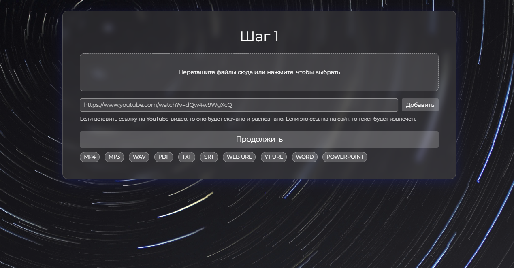

# Lecture Summarizer

## Description

This project uses Whisper and the Google Gemini API to summarize lectures from audio/video files.  It provides a simple web interface for uploading files, selecting processing options, and viewing the generated markdown summaries.




## Features

* **Speech-to-Text Transcription:**  Uses Whisper to convert lecture audio/video into text.
* **Intelligent Summarization:** Leverages the Gemini API to generate detailed and comprehensive summaries.
* **Markdown Output:**  Provides summaries in convenient markdown format.
* **Web Interface:** Easy-to-use interface for uploading files and configuring the summarization process.
* **Multiple File Upload:** Supports uploading and processing multiple audio/video files simultaneously to combine them into one lecture.
* **Language Selection:**  Specify the language of the lecture for more accurate transcription.
* **Whisper Model Size Selection:** Choose different Whisper models (small, medium, large) for varying speed and accuracy trade-offs.
* **Multiple Summarization Attempts:**  Runs the summarization multiple times and selects the output with the most tokens for potentially more detailed results.

## How to Run

1. **Clone the repository:**

   ```bash
   git clone https://github.com/unrlight/Lecture-Summarizer-Py.git
   cd Lecture-Summarizer-Py
   ```

2. **Install the requirements:**

   ```bash
   pip install -r requirements.txt
   ```

3. **Set your Gemini API key:**

    * **Option 1 (Environment Variable):**
      ```bash
       export gemini_api_keys=YOUR_API_KEY # For Linux/macOS
       set gemini_api_keys=YOUR_API_KEY # For Windows
       ```

    * **Option 2 (.env file):**
        Create a `.env` file in the project's root directory and add the following line:
        ```
        gemini_api_keys=YOUR_API_KEY
        ```
    You can get a Gemini API key here: [ai.google.dev](https://ai.google.dev/gemini-api/docs/api-key)

3. **Set your OpenAI API key: (optional)**

    * **Option 1 (Environment Variable):**
      ```bash
       export open_ai_api_keys=YOUR_API_KEY # For Linux/macOS
       set open_ai_api_keys=YOUR_API_KEY # For Windows
       ```

    * **Option 2 (.env file):**
        Create a `.env` file in the project's root directory and add the following line:
        ```
        open_ai_api_keys=YOUR_API_KEY
        ```
    You can get a OpenAI API key here: [platform.openai.com](https://platform.openai.com/api-keys)

4. **Run the application:**
   ```bash
   uvicorn main:app --reload --host 0.0.0.0 --port 8001
   ```

5. **Access the web interface:** Open your web browser and go to `http://localhost:8001`.

## Whisper Model Sizes


| Size   | Parameters | English-only model | Multilingual model | Required VRAM | Relative Speed |
|--------|------------|-------------------|--------------------|---------------|----------------|
| small  | 244 M      | `small.en`        | `small`           | ~2 GB         | ~4x            |
| medium | 769 M      | `medium.en`       | `medium`          | ~5 GB         | ~2x            |
| large  | 1550 M     | N/A              | `large`           | ~10 GB        | 1x             |


Choose the model size based on your available resources and desired speed/accuracy trade-off. Smaller models are faster but less accurate. The first time you run the application, the selected Whisper model will be downloaded. This might take a few minutes depending on your internet connection and the model size.
